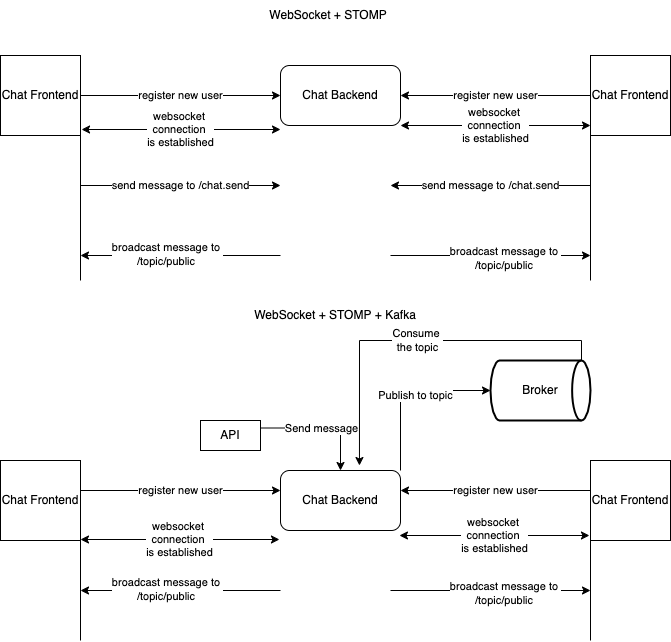

# spring-websocket
Simple chat application with spring websocket

# Technologies
- Websocket over STOMP
- Kafka

# Features:
- Public Chat
- Private Chat

# Run
- Download [Kafka](https://kafka.apache.org/quickstart) and run Zookeeper and Kafka server
```sh
bin/zookeeper-server-start.sh config/zookeeper.properties
bin/kafka-server-start.sh config/server.properties
```
- Create kafka topic
```sh
bin/kafka-topics.sh --create --topic chat --bootstrap-server localhost:9092
```
- Run both chat-frontend and chat-backend (Websocket over STOMP)
- To test kafka, do the REST api call:
```
Public Chat:
Method: POST
Endpoint: /kafka/chat
Body:
{
    "type": "CHAT",
    "content": "New Message to All",
    "sender": "A"
}
```
- Work flow:


